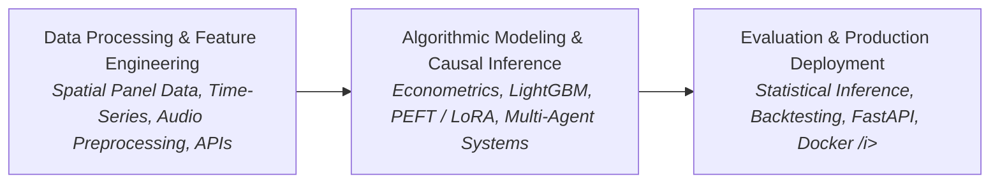

# Luca Neviani
### In the making

  
  
  

  
  
  
  

---

MSc in **Economic Data Analytics** (*Applied Economics*), **University of Padua**.  
BSc in **Business Administration and Management**, **Ca' Foscari University of Venice**.

Quantitative background in economics, advanced econometrics, and causal inference. Over the past two years, my focus has shifted toward **Data Science, Machine Learning, and AI systems**, developing these skills through both academic work and personal projects, research, and real-world applications.

I mostly learn by doing, focusing on building and deploying end-to-end projects: I am passionate about researching and developing machine learning systems, ranging from LLM and speech model fine-tuning to autonomous agents, causal inference, and scalable data pipelines. 

My work focuses on understanding complex datasets, developing appropriate modeling approaches, and applying quantitative methods to extract meaningful insights and solve problems.

I am currently seeking a **Data Scientist / Business Analyst** role in a dynamic environment where I can tackle complex data challenges, ship real-world models, and continuously grow my technical skills on the job.

---

## My Projects

<table width="100%">
<tr>
<td width="50%" valign="top">

### Google Waxal ASR (live)
**Qwen3-ASR 1.7B Fine-Tuning**

Fine-tuned the open-source **Qwen3-ASR (1.7B params)** speech recognitioning model for the Zindi Google Waxal Challenge, adapting it to transcribe three underrepresented African languages: Luganda, Shona, and Lingala. 

- Applied LoRA, a fine-tuning technique, to update only a small subset of trainable parameters instead of retraining the entire model.
- Built an end-to-end audio processing pipeline including 16kHz resampling, audio normalization, and transcript preprocessing, preparing multilingual speech data for model training and evaluation.
- Improved ASR performance substantially, reducing Word Error Rate (WER) from 84.5% (zero-shot base model) to 18.2% after LoRA fine-tuning, and Character Error Rate (CER) from 68.0% to 6.4%.

 
   

 

</td>
<td width="50%" valign="top">

### Causal Impact: Satellite Data (live)
**Renewable Energy Plants in Africa**

Research project developed in collaboration with the University of Padua, investigating the causal environmental and economic impact of solar and wind power plants in Africa. The study combines satellite-based remote sensing data with advanced econometric methods to isolate the causal effect.

- Built and processed a georeferenced panel dataset containing 259,480 observations using **Python and Google Earth Engine**.
- Collected, processed, and integrated large-scale remote sensing data from **NASA and ESA** satellite imagery through APIs.
- Applied advanced statistical and econometric techniques (Staggered DiD) using **Python and R**

 
    

 

</td>
</tr>
<tr>
<td width="50%" valign="top">

### TradingAgents Plus (live)
**Autonomous Multi-Agent Trading System**

Extended Tauric Research's open-source TradingAgents framework, where specialized LLM-powered agents collaborate to perform investment research, analyze financial markets, debate alternative strategies, assess risk, and produce investment decisions.
- Enhanced the framework with a fully autonomous execution pipeline, including scheduled daily analyses, portfolio tracking, real-time risk monitoring, and automated broker execution.
- Integrated multiple specialized AI agents for fundamental, technical, and sentiment analysis.
- Designed a modular architecture enabling continuous portfolio management and end-to-end automation, from market research to trade execution.

  
   

 

Built on <a href="https://github.com/TauricResearch/TradingAgents">TradingAgents</a> by Tauric Research

</td>
<td width="50%" valign="top">

### Numerai Data Science Competition (live)
**Quantitative ML Tournament Model**

Participated in Numerai, a global data science tournament where participants build machine learning models to generate predictive signals for financial markets. 

- Developed an ensemble of LightGBM and XGBoost gradient boosting models optimized for large-scale tabular datasets, for financial time-series prediction.
- Engineered predictive features by applying feature analysis, regularization techniques, and systematic feature selection 
- Implemented walk-forward cross-validation to simulate real-world forecasting conditions and prevent temporal data leakage.
- Achieved top-10 ranked model submission among more than 13,000 competing models.

  
  

 

</td>
</tr>
</table>

---
### Technical Methodology

## Tech Stack & Competencies

| Category | Technologies & Tools |
|---|---|
| **Languages** |    |
| **ML & Data Science** |      |
| **Geospatial & Econometrics** |     |
| **Eng & Visualization** |      |

---

  
  

